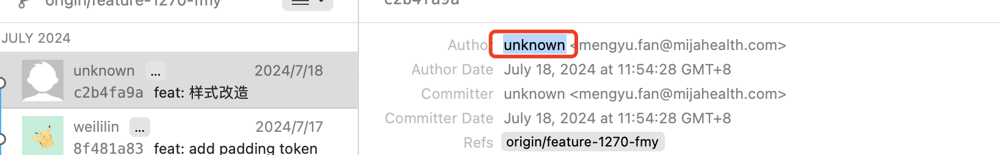

#

1、在左下角新增分支

2、在 `terminal` 中新开 `bash`

3、`git add .`

4、`git commit -m "feat: 封装图片自适应组件 demo"` 注：空格必须要

5、`git push -u origin feature-component-demo`

#

`git reset` ：取消 `Git add`

#

`git status` ：查看 `git add .` 的文档

#

`feat` : 新功能
`chore` : 杂务、日常事务
`fix` ：修复 bug

#

`Merge remote-tracking branch origin/release-1260 into feature-1270-lwl`的意思是将远程分支 origin/release-1260 的最新更改合并到本地分支 feature-1270-lwl 中。

```
// 切换到本地分支 feature-1270-lwl
git checkout feature-1270-lwl
// 拉取远程分支 release-1260 的最新更改
git fetch origin
// 将 origin/release-1260 合并到 feature-1270-lwl
git merge origin/release-1260
```

如果合并过程中出现冲突，你需要手动解决冲突，然后提交合并结果：

```
# 解决冲突后提交合并结果
git add .
git commit -m "Resolved merge conflicts between feature-1270-lwl and release-1260"
```

这样，你就将远程分支 release-1260 的更改成功合并到了本地分支 feature-1270-lwl 中。

在 Git 中，git fetch origin 默认会拉取所有远程分支的最新更改到你的本地远程跟踪分支（例如，origin/release-1260），而不需要指定具体的分支。如果你只想拉取特定分支，可以使用：

```
git fetch origin release-1260
```

这将会更新本地的 origin/release-1260 远程跟踪分支。你不需要指定 origin/release-1260:origin/release-1260，因为远程跟踪分支 origin/release-1260 已经存在并跟踪远程的 release-1260 分支。

#



```
git config user.name  // 为空
git config --global user.name "mengyufan"
git config --list // 查看所有
```

#

为什么 feature-1270-fmy 进行 `git pull` 拿不到分支 feature-1270-lwl 的代码？

执行 `git pull` 只会从远程仓库中获取与当前分支相对应的远程分支的更新。也就是说，如果你在 feature-1270-fmy 分支上执行 `git pull`，它只会从远程仓库中获取 origin/feature-1270-fmy 分支的更新，而不会获取其他分支（如 feature-1270-lwl）的代码。
如果你需要将 feature-1270-lwl 分支的代码合并到你的 feature-1270-fmy 分支中，你需要手动进行操作，具体步骤如下：

```
# 切换到本地分支 feature-1270-fmy
git checkout feature-1270-fmy

# 拉取远程分支 feature-1270-lwl
git fetch origin feature-1270-lwl:feature-1270-lwl

# 合并远程分支 feature-1270-lwl 到本地分支 feature-1270-fmy
git merge feature-1270-lwl
```

如果合并过程中遇到冲突，你需要手动解决冲突并提交合并结果：

```
# 解决冲突后提交合并结果
git add .
git commit -m "Resolved merge conflicts between feature-1270-fmy and feature-1270-lwl"
```

##

`git fetch`时，不需要`git fetch origin feature-1270-lwl:feature-1270-lwl`，只要`git fetch origin feature-1270-lwl`？

通常情况下，你不需要使用 `git fetch origin feature-1270-lwl:feature-1270-lwl`。只需要使用 `git fetch origin feature-1270-lwl` 即可。这会将远程分支 feature-1270-lwl 的最新更改拉取到本地的远程跟踪分支 origin/feature-1270-lwl。

##

`git merge origin/feature-1270-lwl`不可以是`git merge feature-1270-lwl`吗？

在大多数情况下，`git merge origin/feature-1270-lwl` 和 `git merge feature-1270-lwl` 是有区别的：

`git merge origin/feature-1270-lwl`：这是将远程跟踪分支 origin/feature-1270-lwl 的更改合并到当前分支中。

`git merge feature-1270-lwl`:这是将本地分支 feature-1270-lwl 的更改合并到当前分支中。
为了确保你合并的是最新的远程分支的更改，而不是本地分支的更改，通常使用 git merge origin/feature-1270-lwl 更加合适。

## 总结

```
# 拉取远程分支 feature-1300
git fetch origin feature-1300

# 合并远程分支 feature-1300 到本地分支 feature-1270-fmy
git merge origin/feature-1300

git add .
git commit -m "Resolved merge conflicts between feature-1270-fmy and feature-1270-lwl"
```

#

release 用于发版线上环境的分支
feature 需求开发分支

#

```
// Method 1: 储存到暂存区
git add .
git stash
//取出的时候使用(checkout 回当前分支)
git stash pop
```

#

```
git clone -b <branch-name> <repository-url>
```

#

撤回 git commit

```
git reset --soft HEAD^
```

撤回 git reset --soft HEAD^

```
git reset --soft ORIG_HEAD
```

#

Tower：Tower 是一款商业 Git 图形化工具，适用于 Mac 系统。

#

用完要合到 master 上

#

git stash pop "stash@{2}"

#

git log

git reset 你需要回到的那条记录

# 把新提交的代码从远程仓库删除

git log
git reset --hard 你想回到的版本 commit 号
git push origin feature-1.0.0-fmy --force
