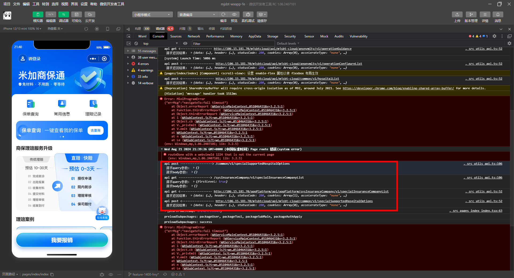
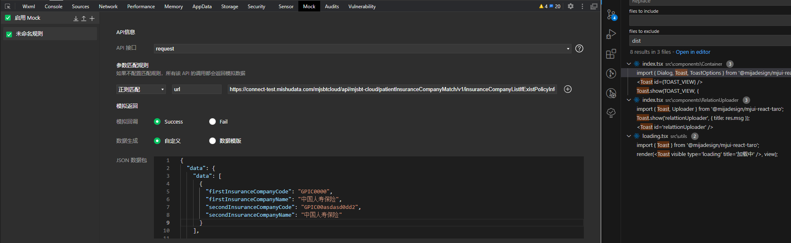

#

```
yarn dev:weapp
```

#

路径在 app.config.ts 里定义

#

pages 数组的第一个元素 pages/index/index 就是小程序的初始页面。

#

设置样式的宽度时，如果去掉 px，只有数字，宽度会失效，但不会被下划线划掉

#

图片路径

```js
import logo from "../../assets/images/logo.png";
;
```

```

```

#

在 css 文件里定义的 px 是会随着分辨率的转化默认转化大小的。 style 不会，所以需要设置 Taro.pxTransform

适配问题其实就按照正常的写法来就可以了

#

每个手机的导航栏高度不一样，所以自定义导航栏时，定位需要按照浮标进行定位

#

{"userId":"1724717814525501440","userName":"13588203459","actualName":"微信用户(3459)","idCard":"000000000000000000","phone":"13588203459","source":3,"choiceHospitalId":null,"choiceHospitalCode":null,"choiceHospitalName":null,"insuranceCompanyId":null,"insuranceCompanySubjectType":null,"insuranceCompanyCode":null,"insuranceCompanyName":null,"insuranceCompanyNameAlias":null,"signKey":"0a5e9fbfcf3f4605b2cdf6829d5ff17e","sid":"16000000728187078","willReset":null,"menuList":null,"realStatus":1,"existUid":true}

sid 是会变的

#

强制更新慢是因为在调试器上，在手机上不会这样

#



这里打印的 api 是指在这个页面调用的接口

#

调试器-->Mock



#

unionId 跟微信号是一对一的关系

#

yarn lint 和 git commit 做的校验是一样的
